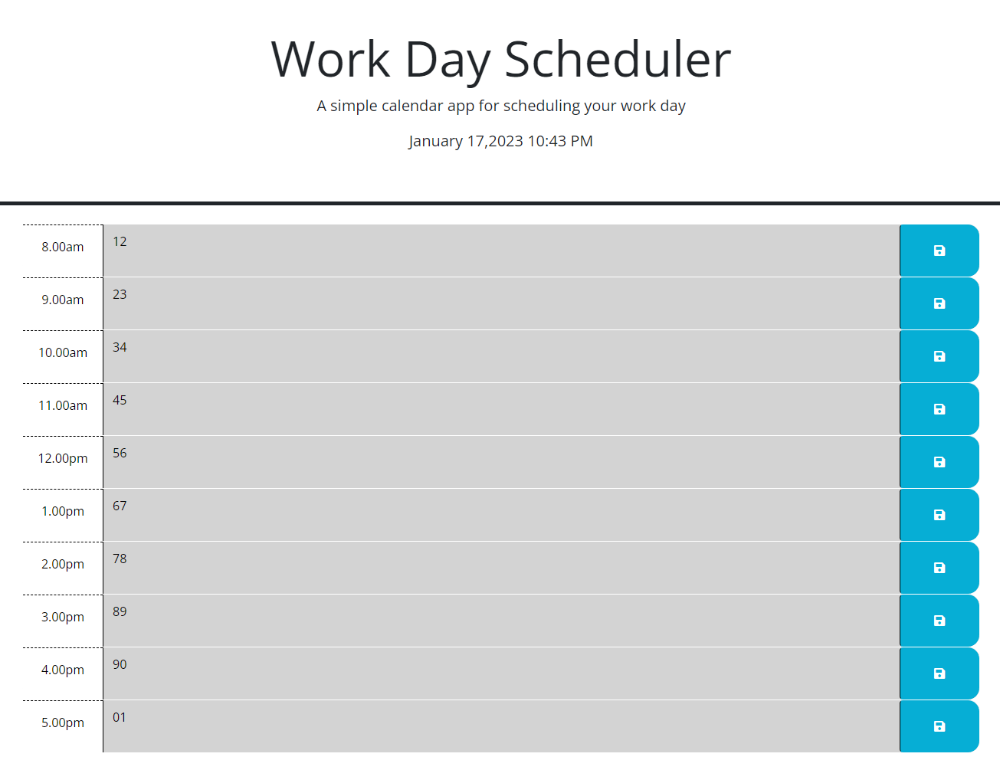

# DMDayPlannerWk5

https://miaodl4.github.io/DMDayPlannerWk5/

## Description

A day planner for the hours between 8am and 5pm with some local storage.

## Table of Contents 

- [Installation](#installation)
- [Usage](#usage)
- [Credits](#credits)
- [License](#license)

## Installation

N/A

## Usage

quite straight forwards you can view the current time and the box change to the following color to repesent their state grey is past, red is current, and green is future
you can also store a some text for for the furture

## Credits

N/a

## License

N/A
